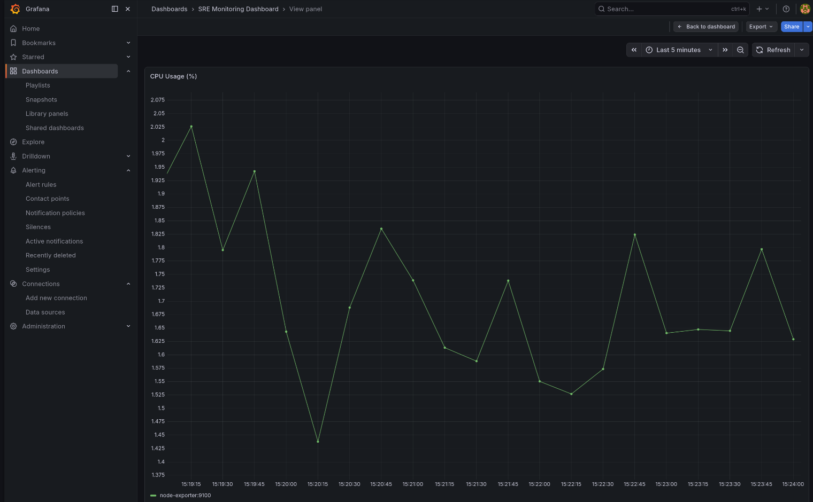
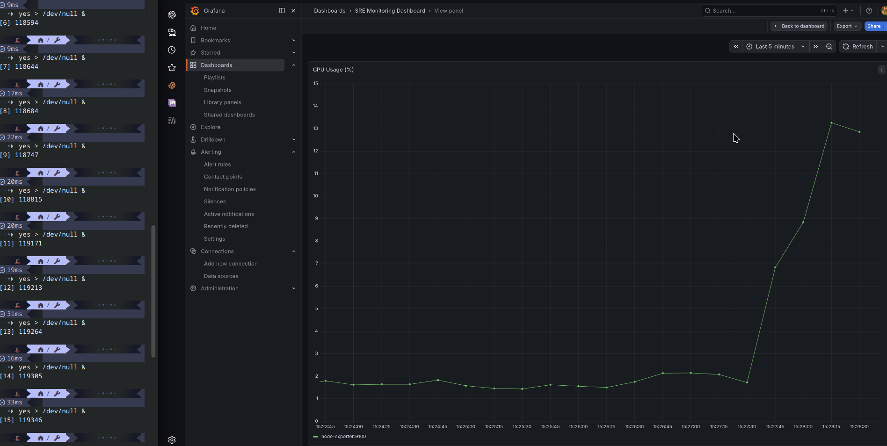
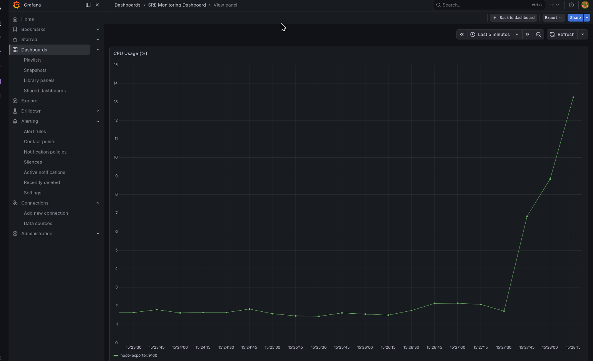

# SRE Monitoring and Alerting System

## Overview

This project demonstrates a complete **Site Reliability Engineering (SRE) monitoring pipeline** using Prometheus and Grafana.

It captures system-level metrics, visualizes real-time performance, and triggers alerts based on threshold conditions, simulating real-world infrastructure monitoring and incident detection.

---

## Architecture

```

```
    +----------------------+
    |   Node Exporter      |
    | (System Metrics)     |
    +----------+-----------+
               |
               v
    +----------------------+
    |     Prometheus       |
    | (Metrics Scraping)   |
    +----------+-----------+
               |
               v
    +----------------------+
    |      Grafana         |
    | (Visualization +     |
    |   Alerting Engine)   |
    +----------+-----------+
               |
               v
    +----------------------+
    |   Contact Point      |
    | (Notification Layer) |
    +----------------------+
```

````

---

## Tech Stack

- **Docker** → containerized deployment  
- **Prometheus** → metrics collection  
- **Grafana** → visualization & alerting  
- **Node Exporter** → system metrics (CPU, memory)  
- **Linux** → environment & process control  

---

## Features

- Real-time CPU monitoring using PromQL  
- Load simulation using stress processes  
- Alerting system (CPU > 5% for 1 minute)  
- Notification pipeline via Grafana contact points  
- State transitions: Normal → Pending → Firing → Recovery  

---

## Demonstration

### 🔹 Normal State (Low CPU Usage)


---

### 🔹 High CPU Usage (Simulated Load)


---

### 🔹 Alert Triggered (FIRING State)


---

## Load Simulation

CPU stress was simulated using:

```bash
yes > /dev/null &
````

Multiple processes were spawned to increase system load:

```bash
yes > /dev/null &
yes > /dev/null &
yes > /dev/null &
yes > /dev/null &
```

---

## Alert Logic

Alert is triggered based on:

```
CPU Usage > 5% for 1 minute
```

CPU usage is computed using Prometheus metrics:

100 - (avg by (instance) (rate(node_cpu_seconds_total{mode="idle"}[1m])) * 100)

Alert condition:
        CPU Usage > 5% for 1 minute

---

## Alert Lifecycle

```
Normal → Pending → FIRING → Recovering → Normal
```

* **Pending**: Condition met but duration not satisfied
* **FIRING**: Condition sustained beyond threshold
* **Recovering**: Load reduced, system stabilizing

---

## Setup Instructions

### 1. Clone Repository

```bash
git clone <your-repo-link>
cd sre-monitoring-demo
```

---

### 2. Start Services

```bash
docker compose up -d
```

---

### 3. Access Services

* Grafana → [http://localhost:3001](http://localhost:3001)
* Prometheus → [http://localhost:9090](http://localhost:9090)

---

### 4. Default Credentials

```
Username: admin
Password: admin
```

---

## Key Learnings

* Observability principles and system metrics
* PromQL for real-time monitoring
* Alerting strategies and threshold design
* System behavior under load and recovery
* Practical understanding of SRE workflows

---

## Incident Simulation (RCA)

* **Incident:** High CPU usage spike.

* **Cause:** Multiple infinite loop processes (`yes` command).

* **Detection:** Prometheus + Grafana alert (>5% for 1 min).

* **Resolution:** Terminated processes using `killall yes`.

* **Prevention:** Alert-based monitoring for abnormal usage.


See detailed RCA here: [RCA.md](RCA.md)


---

## Scope for Future Improvements

* Application-level monitoring (Flask latency tracking)
* Log aggregation (ELK stack)
* Kubernetes deployment
* Auto-scaling based on metrics

---

## Author

Rupesh Das
Computer Science Undergraduate | Systems & AI Enthusiast

---
